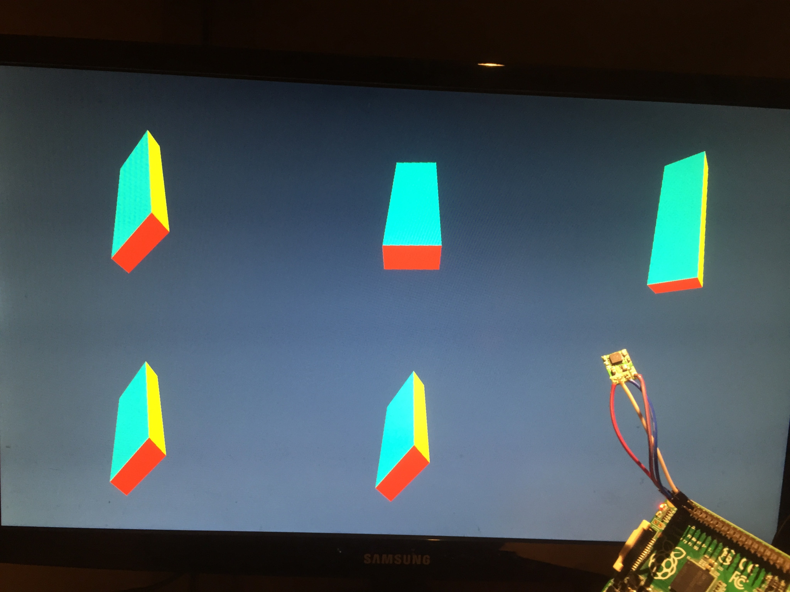

# raspberry-imu-viewer



This tool allows to visualize in 3D the output of various orientation estimation algorithms on a Raspberry Pi, connected via I2C to a MPU6050.

The algorithms are a work in progress, but since the tool works well and there aren't many alternatives around, it is published in order to provide a help for anyone wishing to explore the field of orientation estimation.


## Prerequisites

On the Raspberry Pi, enable I2C in fast-speed mode: edit `/boot/config.txt` and add
```
dtparam=i2c_arm=on
dtparam=i2c_arm_baudrate=400000
```

then edit `/etc/modules` and add
```
i2c-dev
```

a reboot is required.


## Compile & launch

1. clone this repository
   ```
   git clone https://github.com/gswly/raspberry-imu-tester
   ```

2. install dependencies
   ```
   sudo apt-get install -y make \
   gcc \
   libc6-dev \
   libi2c-dev \
   libraspberrypi-dev
   ```

2. build
   ```
   make build_standard
   ```

4. launch
   ```
   ./raspberry-imu-tester
   ```


## Links

* MPU6050 datasheet
  https://store.invensense.com/datasheets/invensense/MPU-6050_DataSheet_V3%204.pdf

* MPU6050 registers
  https://www.invensense.com/wp-content/uploads/2015/02/MPU-6000-Register-Map1.pdf
