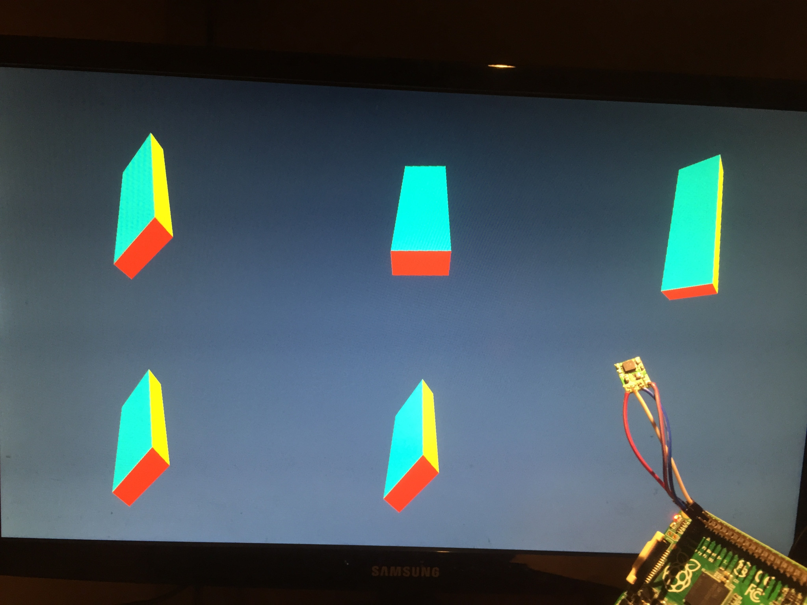

# raspberry-imu-viewer



This tool allows to view in 3D the output of various orientation estimation algorithms, fed by a IMU sensor, connected to a Raspberry Pi. Supported sensors are:
* MPU6000 (I2C mode)
* MPU6050 (I2C mode)
* MPU6500 (I2C mode)
* ICM20600 (I2C mode)
* ICM20601 (I2C mode)
* ICM20602 (I2C mode)

This tool is intended to:
* provide a zero-dependencies, ready-to-use tool to test IMUs
* provide a starting point to anyone wishing to explore the field of orientation estimation


## Build & launch

1. On the Raspberry Pi, enable I2C in fast-speed mode: edit `/boot/config.txt` and add
   ```
   dtparam=i2c_arm=on
   dtparam=i2c_arm_baudrate=400000
   ```

   then edit `/etc/modules` and add
   ```
   i2c-dev
   ```

   a reboot is required.

2. clone this repository
   ```
   git clone https://github.com/gswly/raspberry-imu-viewer
   cd raspberry-imu-viewer
   ```

3. install dependencies
   ```
   sudo apt install -y make gcc libc6-dev libi2c-dev libraspberrypi-dev
   ```

4. build
   ```
   make
   ```

5. launch
   ```
   ./raspberry-imu-viewer
   ```
